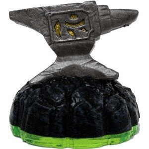

```python
### Items
----------------------------------------|-------------|------
 Anvil Rain                              | 200         | 0
Hidden Treasure                         | 201         | 0
Platinum Hidden Treasure (UNRELEASED)   | 201         | 4096
Healing Elixir                          | 202         | 0
Ghost Pirate                            | 203         | 0
Time Twister Hourglass                  | 204         | 0
Sky-Iron                                | 205         | 0
Winged Boots                            | 206         | 0
Sparx the Dragonfly                     | 207         | 0
Dragonfire Cannon                       | 208         | 4614
Golden Dragonfire Cannon                | 208         | 5634
Scorpion Striker Catapult               | 209         | 4614
Hand of Fate                            | 230         | 12288
Legendary Hand of Fate                  | 230         | 13315
Piggy Bank                              | 231         | 12288
Rocket Ram                              | 232         | 12288
Tiki Speaky                             | 233         | 12288
----------------------------------------|-------------|------
```
```python
### Traps
--------------------------------------|-------------|------
Biter's Bane (Magic Log Holder)       | 210         | 12290
Sorcerous Skull (Magic Skull)         | 210         | 12296
Axe of Illusion (Magic Axe)           | 210         | 12299
Arcane Hourglass (Magic Hourglass)    | 210         | 12302
Spell Slapper (Magic Totem)           | 210         | 12306
Rune Rocket (Magic Rocket)            | 210         | 12309
Tidal Tiki (Water Tiki)               | 211         | 12289
Wet Walter (Water Log Holder)         | 211         | 12290
Flood Flask (Water Jughead)           | 211         | 12294
Legendary Flood Flask (Water Jughead) | 211         | 13318
Soaking Staff (Water Angel)           | 211         | 12295
Aqua Axe (Water Axe)                  | 211         | 12299
Frost Helm (Water Flying Helmet)      | 211         | 12310
Breezy Bird (Air Toucan)              | 212         | 12291
Drafty Decanter (Air Jughead)         | 212         | 12294
Tempest Timer (Air Hourglass)         | 212         | 12302
Cloudy Cobra (Air Snake)              | 212         | 12304
Storm Warning (Air Screamer)          | 212         | 12305
Cyclone Sabre (Air Sword)             | 212         | 12312
Spirit Sphere (Undead Orb)            | 213         | 12292
Legendary Spirit Sphere (Undead Orb)  | 213         | 13316
Spectral Skull (Undead Skull)         | 213         | 12296
Legendary Spectral Skull (Undead Orb) | 213         | 13320
Haunted Hatchet (Undead Axe)          | 213         | 12299
Grim Gripper (Undead Hand)            | 213         | 12300
Spooky Snake (Undead Snake)           | 213         | 12304
Dream Piercer (Undead Captain's Hat)  | 213         | 12311
Tech Totem (Tech Tiki)                | 214         | 12289
Automatic Angel (Tech Angel)          | 214         | 12295
Factory Flower (Tech Scepter)         | 214         | 12297
Grabbing Gadget (Tech Hand)           | 214         | 12300
Makers Mana (Tech Flying Helmet)      | 214         | 12310
Topsy Techy (Tech Handstand)          | 214         | 12314
Eternal Flame (Fire Torch)            | 215         | 12293
Fire Flower (Fire Scepter)            | 215         | 12297
Scorching Stopper (Fire Screamer)     | 215         | 12305
Searing Spinner (Fire Totem)          | 215         | 12306
Spark Speak (Fire Captain's Hat)      | 215         | 12311
Blazing Belch (Fire Yawn)             | 215         | 12315
Rock Hawk (Earth Toucan)              | 216         | 12291
Banded Boulder (Earth Orb)            | 216         | 12292
Slag Hammer (Earth Hammer)            | 216         | 12298
Dust of Time (Earth Hourglass)        | 216         | 12302
Spinning Sandstorm (Earth Totem)      | 216         | 12306
Rubble Trouble (Earth Handstand)      | 216         | 12314
Oak Eagle (Life Toucan)               | 217         | 12291
Emerald Energy (Life Torch)           | 217         | 12293
Weed Whacker (Life Hammer)            | 217         | 12298
Seed Serpent (Life Snake)             | 217         | 12304
Jade Blade (Life Sword)               | 217         | 12312
Shrub Shrieker (Life Yawn)            | 217         | 12315
Shadow Spider (Dark Spider)           | 218         | 12308
Dark Dagger (Dark Sword)              | 218         | 12312
Ghastly Grimace (Dark Handstand)      | 218         | 12314
Heavenly Hawk (Light Hawk)            | 219         | 12303
Shining Ship (Light Rocket)           | 219         | 12309
Beam Scream (Light Yawn)              | 219         | 12315
The Kaos Trap                         | 220         | 12318
Ultimate Kaos Trap                    | 220         | 13599
--------------------------------------|-------------|------
```
```python
### Toys For Bob Expansions
-------------------------|-------------|------
Dragon's Peak            | 300         | 0
Empire of Ice            | 301         | 0
Pirate Seas              | 302         | 0
Darklight Crypt          | 303         | 0
Volcanic Vault           | 304         | 0
Mirror of Mystery        | 305         | 12288
Nightmare Express        | 306         | 12288
Sunscraper Spire         | 307         | 12800
Midnight Museum          | 308         | 12800
Gryphon Park Observatory | 310         | 20480
Enchanted Elven Forest   | 311         | 20480
-------------------------|-------------|------
```
```python
### SSA Legendaries
------------------------|-------------|--
Legendary Bash          | 404         | 0
Legendary Spyro         | 416         | 0
Legendary Trigger Happy | 419         | 0
Legendary Chop Chop     | 430         | 0
------------------------|-------------|--
```
```python
### Trap Team
-----------------------------|-------------|------
Gusto                        | 450         | 12288
Thunderbolt                  | 451         | 12288
Thunderbolt Special          | 451         | 12317
Fling Kong                   | 452         | 12288
Blades                       | 453         | 12288
Legendary Blades             | 453         | 13315
Wallop                       | 454         | 12288
Head Rush                    | 455         | 12288
Nitro Head Rush              | 455         | 13314
Fist Bump                    | 456         | 12288
Rocky Roll                   | 457         | 12288
Wildfire                     | 458         | 12288
Dark Wildfire                | 458         | 13314
Ka-Boom                      | 459         | 12288
Trail Blazer                 | 460         | 12288
Torch                        | 461         | 12288
Snap Shot                    | 462         | 12288
Snap Shot (UNRELEASED Event) | 462         | 12292
Dark Snap Shot               | 462         | 13314
Instant Snap Shot            | 462         | 13327
Lob-Star                     | 463         | 12288
Winterfest Lob-Star          | 463         | 13314
Flip Wreck                   | 464         | 12288
Echo                         | 465         | 12288
Blastermind                  | 466         | 12288
Enigma                       | 467         | 12288
Déjà Vu                      | 468         | 12288
Legendary Déjà Vu            | 468         | 13315
Cobra Cadabra                | 469         | 12288
King Cobra Cadabra           | 469         | 13314
Jawbreaker                   | 470         | 12288
Legendary Jawbreaker         | 470         | 13315
Gearshift                    | 471         | 12288
Chopper                      | 472         | 12288
Tread Head                   | 473         | 12288
Bushwhack                    | 474         | 12288
Legendary Bushwhack          | 474         | 13315
Tuff Luck                    | 475         | 12288
Tuff Luck Special            | 475         | 12317
Food Fight                   | 476         | 12288
Dark Food Fight              | 476         | 13314
Instant Food Fight           | 476         | 13327
High Five                    | 477         | 12288
Krypt King                   | 478         | 12288
Nitro Krypt King             | 478         | 13314
Short Cut                    | 479         | 12288
Short Cut Special            | 479         | 12317
Bat Spin                     | 480         | 12288
Funny Bone                   | 481         | 12288
Knight Light                 | 482         | 12288
Spotlight                    | 483         | 12288
Knight Mare                  | 484         | 12288
Blackout                     | 485         | 12288
-----------------------------|-------------|------
```
```python
### Minis
Skylander                 | CharacterID | VariantID
--------------------------|-------------|------
Bop                       | 502         | 12288
Spry                      | 503         | 12288
Hijinx                    | 504         | 12288
Terrabite (Sidekick)      | 505         | 0
Terrabite (Mini)          | 505         | 12288
Breeze                    | 506         | 12288
Weeruptor                 | 507         | 12288
Eggsellent Weeruptor      | 507         | 13314
Pet-Vac                   | 508         | 12288
Power Punch Pet-Vac       | 508         | 13314
Small Fry                 | 509         | 12288
Drobit                    | 510         | 12288
Gill Runt (Sidekick)      | 511         | 0
Gill Runt (Mini)          | 511         | 12288
Trigger Snappy (Sidekick) | 519         | 0
Trigger Snappy (Mini)     | 519         | 12288
Whisper Elf (Sidekick)    | 526         | 0
Whisper Elf (Mini)        | 526         | 12288
Barkley (Sidekick)        | 540         | 4096
Barkley (Mini)            | 540         | 12288
Gnarly Barkley            | 540         | 13314
Thumpling (Sidekick)      | 541         | 4096
Thumpling (Mini)          | 541         | 12288
Mini-Jini (Sidekick)      | 542         | 4096
Mini-Jini (Mini)          | 542         | 12288
Eye-Small (Sidekick)      | 543         | 4096
Eye-Small (Mini)          | 543         | 12288
--------------------------|-------------|------
```

```python
### SWAP Force
-------------------------|-------------|------
Jet                      | 1000        | 8192
Ranger                   | 1001        | 8192
Legendary Ranger         | 1001        | 9219
Rouser                   | 1002        | 8192
Stone                    | 1003        | 8192
Stone (Bronze?)          | 1003        | 8214
Zone                     | 1004        | 8192
Dark Zone                | 1004        | 9218
Kraken                   | 1005        | 8192
Kraken (Gold?)           | 1005        | 8196
Jade Kraken              | 1005        | 9218
Bomb                     | 1006        | 8192
Bomb (Gold?)             | 1006        | 8214
Drilla                   | 1007        | 8192
Loop                     | 1008        | 8192
Enchanted Loop           | 1008        | 9218
Shadow                   | 1009        | 8192
Shadow (Silver?)         | 1009        | 8214
Charge                   | 1010        | 8192
Nitro Charge             | 1010        | 9218
Rise                     | 1011        | 8192
Shift                    | 1012        | 8192
Legendary Shift          | 1012        | 9219
Shake                    | 1013        | 8192
Quickdraw Shake          | 1013        | 9218
Blade                    | 1014        | 8192
Nitro Blade              | 1014        | 9218
Buckler                  | 1015        | 8192
Buckler (Color Shift)    | 1015        | 8216
Dark Buckler             | 1015        | 9218
Template (Bottom)        | 1999        | 8192
Boom                     | 2000        | 8192
Free                     | 2001        | 8192
Legendary Free           | 2001        | 9219
Rubble                   | 2002        | 8192
Doom                     | 2003        | 8192
Doom (Gold?)             | 2003        | 8214
Blast                    | 2004        | 8192
Dark Blast               | 2004        | 9218
Fire                     | 2005        | 8192
Fire (Gold?)             | 2005        | 8196
Jade Fire                | 2005        | 9218
Stink                    | 2006        | 8192
Stink (Silver?)          | 2006        | 8214
Grilla                   | 2007        | 8192
Hoot                     | 2008        | 8192
Enchanted Hoot           | 2008        | 9218
Trap                     | 2009        | 8192
Trap (Bronze?)           | 2009        | 8214
Magna                    | 2010        | 8192
Nitro Magna              | 2010        | 9218
Spy                      | 2011        | 8192
Night                    | 2012        | 8192
Legendary Night          | 2012        | 9219
Rattle                   | 2013        | 8192
Quickdraw Rattle         | 2013        | 9218
Freeze                   | 2014        | 8192
Nitro Freeze             | 2014        | 9218
Wash                     | 2015        | 8192
Wash (Color Shift)       | 2015        | 8216
Dark Wash                | 2015        | 9218
Template (Top)           | 2999        | 8192
Scratch                  | 3000        | 8192
Pop Thorn                | 3001        | 8192
Slobber Tooth            | 3002        | 8192
Dark Slobber Tooth       | 3002        | 9218
Scorp                    | 3003        | 8192
Scorp (Green?)           | 3003        | 8214
Fryno                    | 3004        | 8192
Hog Wild Fryno           | 3004        | 14341
Smolderdash              | 3005        | 8192
Smolderdash (LightCore)  | 3005        | 8710
Snowderdash (???)        | 3005        | 8729
Bumble Blast             | 3006        | 8192
Bumble Blast (LightCore) | 3006        | 8710
Jolly Bumble Blast       | 3006        | 9218
Zoo Lou                  | 3007        | 8192
Legendary Zoo Lou        | 3007        | 9219
Dune Bug                 | 3008        | 8192
Dune Bug (Red?)          | 3008        | 8196
Star Strike              | 3009        | 8192
Star Strike (LightCore)  | 3009        | 8710
Enchanted Star Strike    | 3009        | 9730
Countdown                | 3010        | 8192
Countdown (LightCore)    | 3010        | 8710
Kickoff Countdown        | 3010        | 9218
Wind-Up                  | 3011        | 8192
VVind-Up (Gear Head)     | 3011        | 9220
Roller Brawl             | 3012        | 8192
Grim Creeper             | 3013        | 8192
Grim Creeper (LightCore) | 3013        | 8710
Legendary Grim Creeper   | 3013        | 9731
Rip Tide                 | 3014        | 8192
Rip Tide (Green?)        | 3014        | 8214
Punk Shock               | 3015        | 8192
Template Legacy          | 3999        | 8192
-------------------------|-------------|------
```
```python
### SWAP Force Expansions/Battle Pieces
Skylander          | CharacterID | VariantID
-------------------|-------------|-----
Sheep Wreck Island | 3300        | 8192
Tower of Time      | 3301        | 8192
Fiery Forge        | 3301        | 8710
Arkeyan Crossbow   | 3302        | 0
-------------------|-------------|-----
```